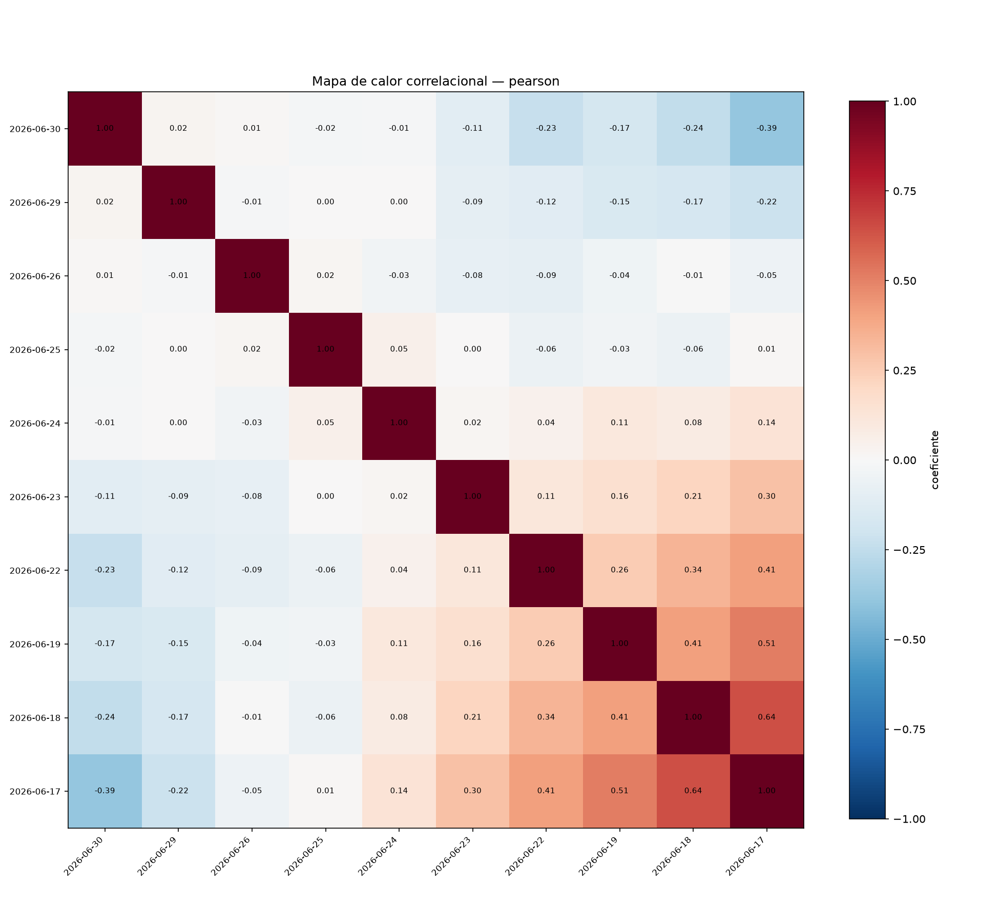
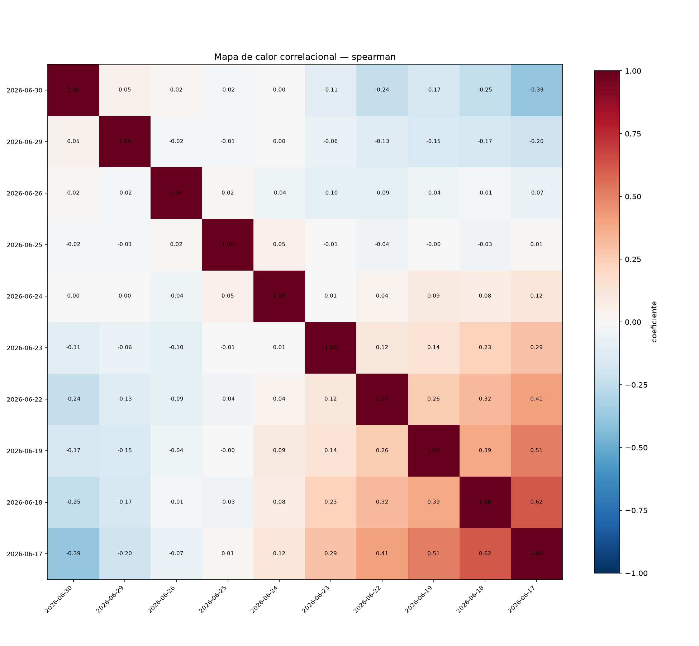

# Amostragem — correlação cruzada (WINJ26, 10 dias)

## Parâmetros

- valor da série: `log_return`
- métodos: pearson, spearman
- janela: 09:00–17:55 (America/Sao_Paulo)
- cobertura mínima: 90%
- sub-janelas de estabilidade: 3

## Cobertura por dia

| dia | cobertura | |
|---|---|---|
| 2026-06-17 | 100.0% |  |
| 2026-06-18 | 100.0% |  |
| 2026-06-19 | 100.0% |  |
| 2026-06-22 | 100.0% |  |
| 2026-06-23 | 100.0% |  |
| 2026-06-24 | 100.0% |  |
| 2026-06-25 | 100.0% |  |
| 2026-06-26 | 100.0% |  |
| 2026-06-29 | 100.0% |  |
| 2026-06-30 | 100.0% |  |

## Resultados

### pearson

Pares: 45 · significativos (p < 0.05): 23

| d_i | d_j | lag (dias) | coef. | p-valor | estab. (σ) |
|---|---|---|---|---|---|
| 2026-06-18 | 2026-06-17 | 1 | 0.641 | 0.000 | 0.020 |
| 2026-06-19 | 2026-06-17 | 2 | 0.514 | 0.000 | 0.079 |
| 2026-06-19 | 2026-06-18 | 1 | 0.410 | 0.000 | 0.004 |
| 2026-06-22 | 2026-06-17 | 5 | 0.408 | 0.000 | 0.052 |
| 2026-06-30 | 2026-06-17 | 13 | -0.387 | 0.000 | 0.075 |
| 2026-06-22 | 2026-06-18 | 4 | 0.340 | 0.000 | 0.014 |
| 2026-06-23 | 2026-06-17 | 6 | 0.295 | 0.000 | 0.060 |
| 2026-06-22 | 2026-06-19 | 3 | 0.256 | 0.000 | 0.041 |
| 2026-06-30 | 2026-06-18 | 12 | -0.243 | 0.000 | 0.086 |
| 2026-06-30 | 2026-06-22 | 8 | -0.231 | 0.000 | 0.063 |

### spearman

Pares: 45 · significativos (p < 0.05): 23

| d_i | d_j | lag (dias) | coef. | p-valor | estab. (σ) |
|---|---|---|---|---|---|
| 2026-06-18 | 2026-06-17 | 1 | 0.618 | 0.000 | 0.035 |
| 2026-06-19 | 2026-06-17 | 2 | 0.510 | 0.000 | 0.089 |
| 2026-06-22 | 2026-06-17 | 5 | 0.411 | 0.000 | 0.057 |
| 2026-06-30 | 2026-06-17 | 13 | -0.389 | 0.000 | 0.098 |
| 2026-06-19 | 2026-06-18 | 1 | 0.386 | 0.000 | 0.010 |
| 2026-06-22 | 2026-06-18 | 4 | 0.324 | 0.000 | 0.017 |
| 2026-06-23 | 2026-06-17 | 6 | 0.290 | 0.000 | 0.060 |
| 2026-06-22 | 2026-06-19 | 3 | 0.256 | 0.000 | 0.051 |
| 2026-06-30 | 2026-06-18 | 12 | -0.248 | 0.000 | 0.092 |
| 2026-06-30 | 2026-06-22 | 8 | -0.236 | 0.000 | 0.083 |

