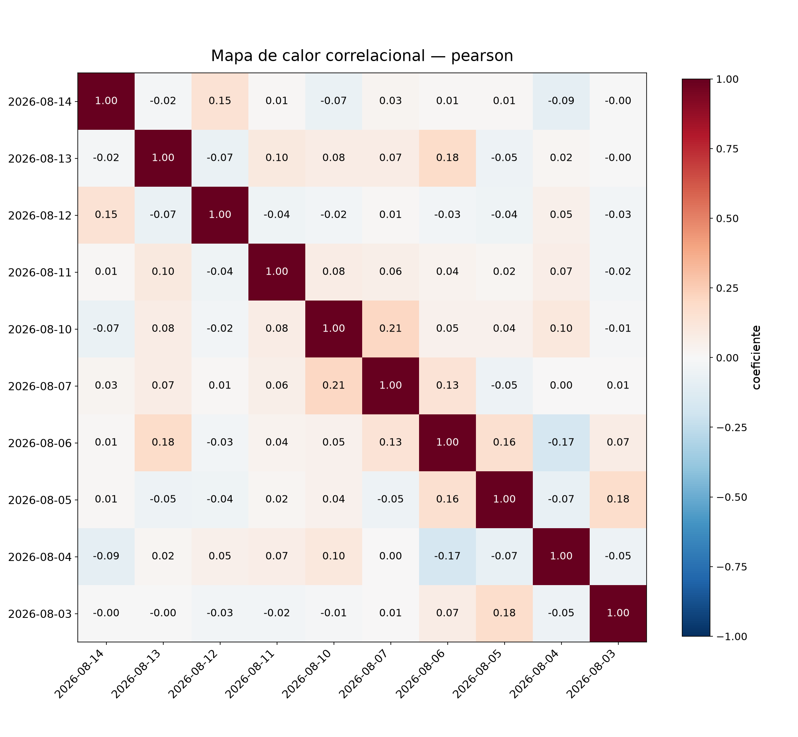
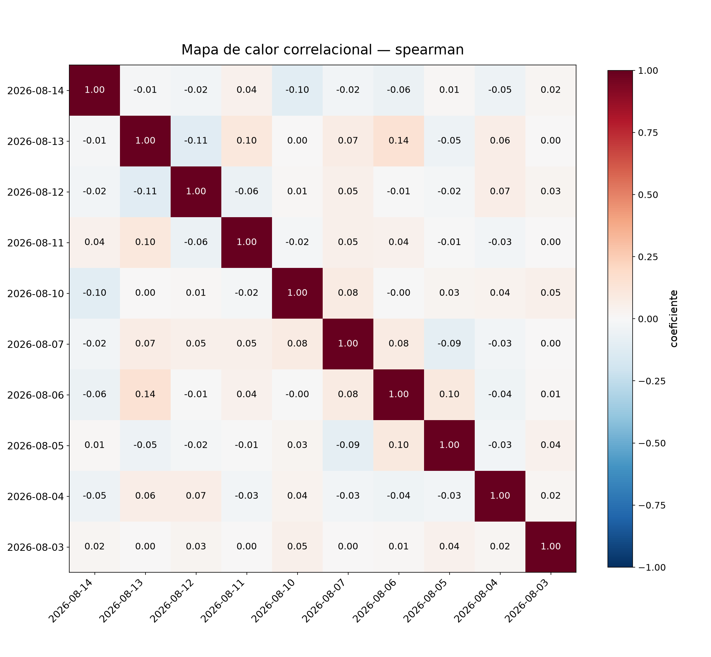
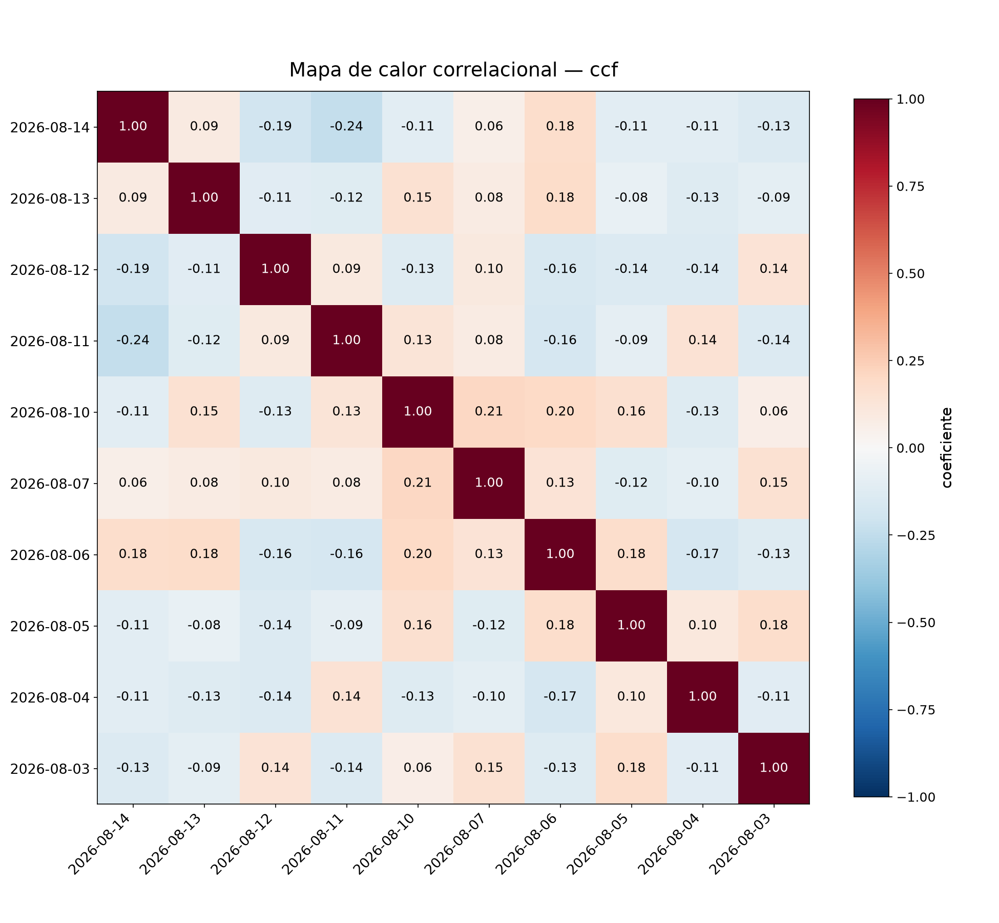
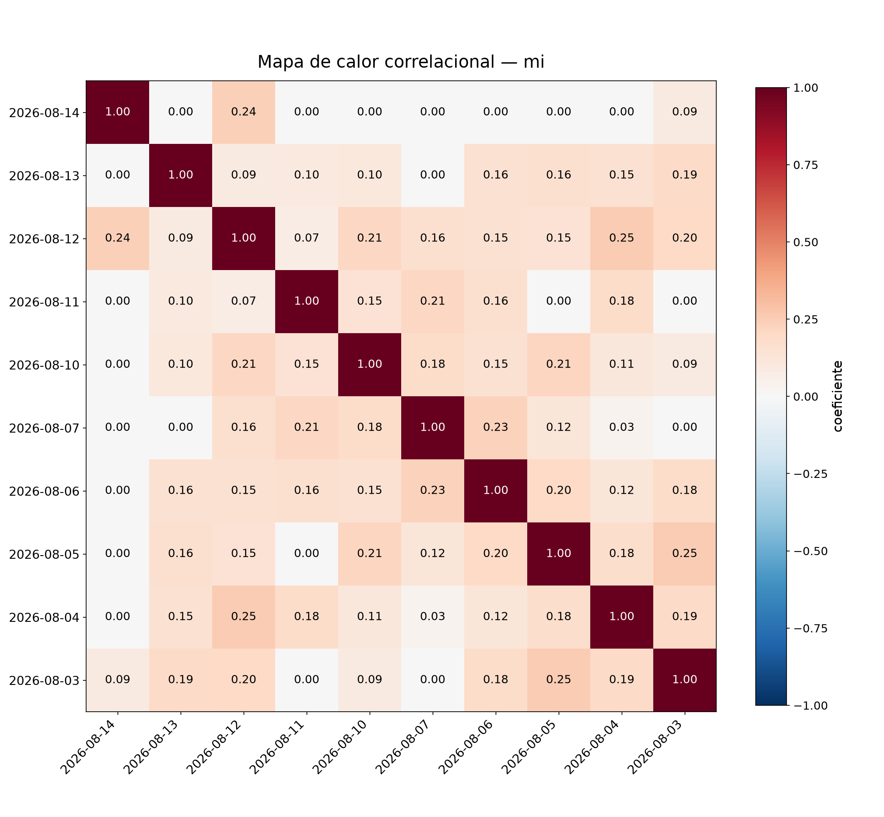
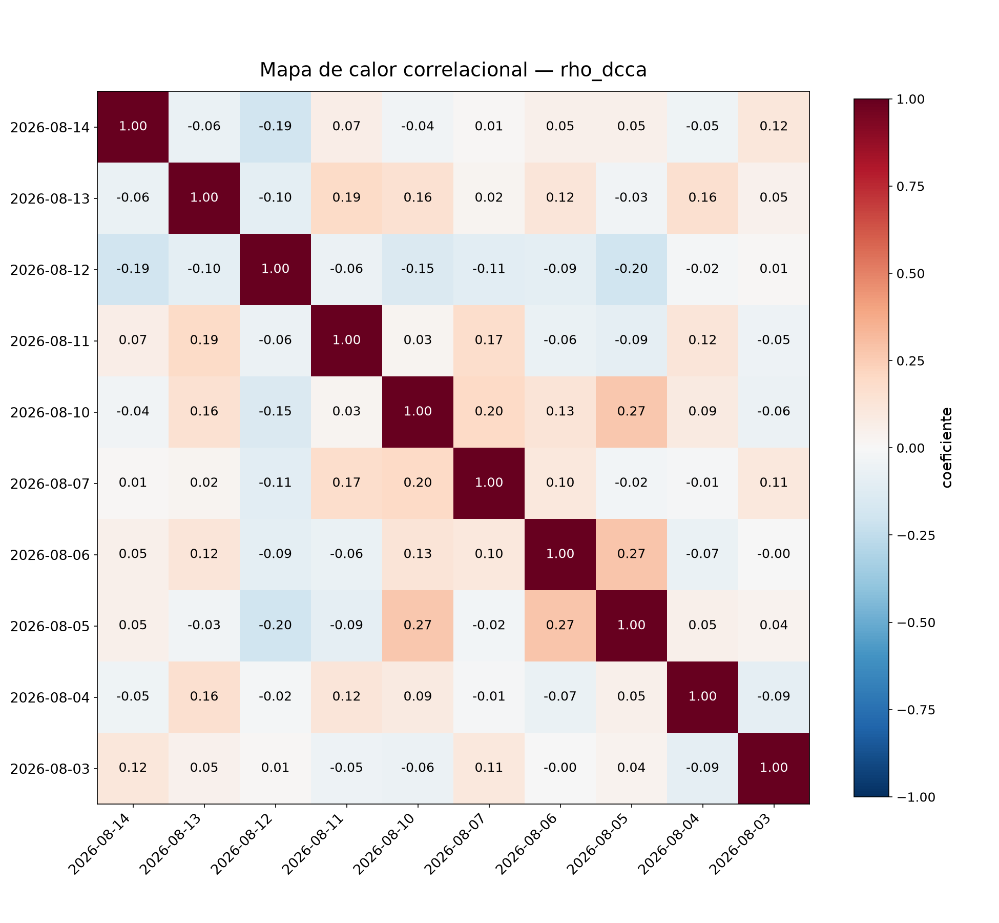
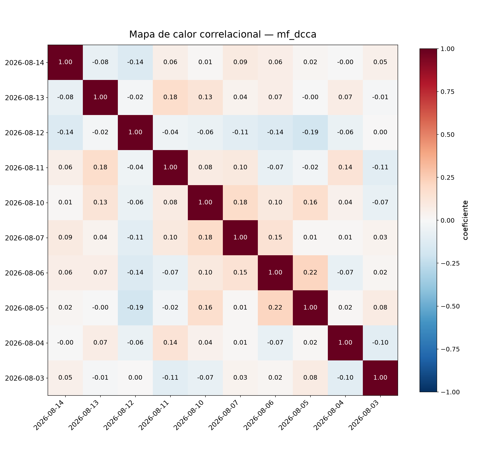

# Amostragem — correlação cruzada (WINQ26, 10 dias)

## Parâmetros

- valor da série: `log_return`
- métodos: pearson, spearman, ccf, mi, rho_dcca, mf_dcca
- janela: 09:00–17:55 (America/Sao_Paulo)
- cobertura mínima: 90%
- sub-janelas de estabilidade: 3
- informação mútua: 8 bins por quantis
- escala DCCA: 20 min
- ordem q do MF-DCCA (ρ_q): 4
- surrogates (deslocamento circular): 199 · semente 0

## Cobertura por dia

| dia | cobertura | |
|---|---|---|
| 2026-08-03 | 99.4% |  |
| 2026-08-04 | 99.6% |  |
| 2026-08-05 | 99.4% |  |
| 2026-08-06 | 99.6% |  |
| 2026-08-07 | 99.4% |  |
| 2026-08-10 | 99.6% |  |
| 2026-08-11 | 99.4% |  |
| 2026-08-12 | 100.0% |  |
| 2026-08-13 | 99.4% |  |
| 2026-08-14 | 100.0% |  |

## Resultados

### pearson

Pares: 45 · significativos (p < 0.05): 10

| d_i | d_j | lag (dias) | coef. | p-valor | lag (min) | estab. (σ) |
|---|---|---|---|---|---|---|
| 2026-08-10 | 2026-08-07 | 3 | 0.209 | 0.000 | 0 | 0.188 |
| 2026-08-13 | 2026-08-06 | 7 | 0.182 | 0.000 | 0 | 0.064 |
| 2026-08-05 | 2026-08-03 | 2 | 0.176 | 0.000 | 0 | 0.144 |
| 2026-08-06 | 2026-08-04 | 2 | -0.167 | 0.000 | 0 | 0.121 |
| 2026-08-06 | 2026-08-05 | 1 | 0.163 | 0.000 | 0 | 0.086 |
| 2026-08-14 | 2026-08-12 | 2 | 0.146 | 0.001 | 0 | 0.097 |
| 2026-08-07 | 2026-08-06 | 1 | 0.134 | 0.002 | 0 | 0.051 |
| 2026-08-10 | 2026-08-04 | 6 | 0.104 | 0.016 | 0 | 0.119 |
| 2026-08-13 | 2026-08-11 | 2 | 0.098 | 0.024 | 0 | 0.031 |
| 2026-08-14 | 2026-08-04 | 10 | -0.092 | 0.034 | 0 | 0.074 |

### spearman

Pares: 45 · significativos (p < 0.05): 6

| d_i | d_j | lag (dias) | coef. | p-valor | lag (min) | estab. (σ) |
|---|---|---|---|---|---|---|
| 2026-08-13 | 2026-08-06 | 7 | 0.144 | 0.001 | 0 | 0.062 |
| 2026-08-13 | 2026-08-12 | 1 | -0.110 | 0.011 | 0 | 0.065 |
| 2026-08-13 | 2026-08-11 | 2 | 0.104 | 0.016 | 0 | 0.065 |
| 2026-08-14 | 2026-08-10 | 4 | -0.102 | 0.019 | 0 | 0.066 |
| 2026-08-06 | 2026-08-05 | 1 | 0.096 | 0.027 | 0 | 0.121 |
| 2026-08-07 | 2026-08-05 | 2 | -0.093 | 0.031 | 0 | 0.048 |
| 2026-08-10 | 2026-08-07 | 3 | 0.082 | 0.058 | 0 | 0.121 |
| 2026-08-07 | 2026-08-06 | 1 | 0.080 | 0.066 | 0 | 0.053 |
| 2026-08-13 | 2026-08-07 | 6 | 0.075 | 0.085 | 0 | 0.061 |
| 2026-08-12 | 2026-08-04 | 8 | 0.067 | 0.124 | 0 | 0.069 |

### ccf

Pares: 45 · significativos (p < 0.05): 40

| d_i | d_j | lag (dias) | coef. | p-valor | lag (min) | estab. (σ) |
|---|---|---|---|---|---|---|
| 2026-08-14 | 2026-08-11 | 3 | -0.237 | 0.000 | 4 | 0.186 |
| 2026-08-10 | 2026-08-07 | 3 | 0.209 | 0.000 | 0 | 0.188 |
| 2026-08-10 | 2026-08-06 | 4 | 0.202 | 0.000 | -3 | 0.200 |
| 2026-08-14 | 2026-08-12 | 2 | -0.191 | 0.000 | 1 | 0.157 |
| 2026-08-13 | 2026-08-06 | 7 | 0.182 | 0.000 | 0 | 0.135 |
| 2026-08-05 | 2026-08-03 | 2 | 0.176 | 0.000 | 0 | 0.145 |
| 2026-08-14 | 2026-08-06 | 8 | 0.176 | 0.000 | 3 | 0.165 |
| 2026-08-06 | 2026-08-05 | 1 | 0.175 | 0.000 | 2 | 0.056 |
| 2026-08-06 | 2026-08-04 | 2 | -0.167 | 0.000 | 0 | 0.153 |
| 2026-08-11 | 2026-08-06 | 5 | -0.164 | 0.000 | -1 | 0.141 |

### mi

Pares: 45 · significativos (p < 0.05): 9

| d_i | d_j | lag (dias) | coef. | p-valor | lag (min) | estab. (σ) |
|---|---|---|---|---|---|---|
| 2026-08-05 | 2026-08-03 | 2 | 0.254 | 0.010 | 0 | 0.000 |
| 2026-08-12 | 2026-08-04 | 8 | 0.252 | 0.005 | 0 | 0.158 |
| 2026-08-14 | 2026-08-12 | 2 | 0.236 | 0.010 | 0 | 0.149 |
| 2026-08-07 | 2026-08-06 | 1 | 0.227 | 0.015 | 0 | 0.068 |
| 2026-08-10 | 2026-08-05 | 5 | 0.213 | 0.025 | 0 | 0.159 |
| 2026-08-11 | 2026-08-07 | 4 | 0.211 | 0.015 | 0 | 0.048 |
| 2026-08-12 | 2026-08-10 | 2 | 0.206 | 0.025 | 0 | 0.120 |
| 2026-08-06 | 2026-08-05 | 1 | 0.198 | 0.035 | 0 | 0.138 |
| 2026-08-12 | 2026-08-03 | 9 | 0.196 | 0.040 | 0 | 0.081 |
| 2026-08-13 | 2026-08-03 | 10 | 0.192 | 0.070 | 0 | 0.029 |

### rho_dcca

Pares: 45 · significativos (p < 0.05): 10

| d_i | d_j | lag (dias) | coef. | p-valor | lag (min) | estab. (σ) |
|---|---|---|---|---|---|---|
| 2026-08-06 | 2026-08-05 | 1 | 0.275 | 0.005 | 0 | 0.144 |
| 2026-08-10 | 2026-08-05 | 5 | 0.273 | 0.005 | 0 | 0.116 |
| 2026-08-10 | 2026-08-07 | 3 | 0.198 | 0.010 | 0 | 0.307 |
| 2026-08-12 | 2026-08-05 | 7 | -0.196 | 0.005 | 0 | 0.166 |
| 2026-08-14 | 2026-08-12 | 2 | -0.194 | 0.005 | 0 | 0.014 |
| 2026-08-13 | 2026-08-11 | 2 | 0.189 | 0.005 | 0 | 0.086 |
| 2026-08-11 | 2026-08-07 | 4 | 0.175 | 0.020 | 0 | 0.020 |
| 2026-08-13 | 2026-08-04 | 9 | 0.157 | 0.030 | 0 | 0.231 |
| 2026-08-13 | 2026-08-10 | 3 | 0.155 | 0.060 | 0 | 0.101 |
| 2026-08-12 | 2026-08-10 | 2 | -0.147 | 0.025 | 0 | 0.153 |

### mf_dcca

Pares: 45 · significativos (p < 0.05): 15

| d_i | d_j | lag (dias) | coef. | p-valor | lag (min) | estab. (σ) |
|---|---|---|---|---|---|---|
| 2026-08-06 | 2026-08-05 | 1 | 0.216 | 0.005 | 0 | 0.095 |
| 2026-08-12 | 2026-08-05 | 7 | -0.187 | 0.005 | 0 | 0.124 |
| 2026-08-10 | 2026-08-07 | 3 | 0.180 | 0.005 | 0 | 0.215 |
| 2026-08-13 | 2026-08-11 | 2 | 0.177 | 0.005 | 0 | 0.085 |
| 2026-08-10 | 2026-08-05 | 5 | 0.164 | 0.005 | 0 | 0.068 |
| 2026-08-07 | 2026-08-06 | 1 | 0.148 | 0.010 | 0 | 0.055 |
| 2026-08-11 | 2026-08-04 | 7 | 0.140 | 0.025 | 0 | 0.088 |
| 2026-08-14 | 2026-08-12 | 2 | -0.140 | 0.005 | 0 | 0.035 |
| 2026-08-12 | 2026-08-06 | 6 | -0.137 | 0.010 | 0 | 0.104 |
| 2026-08-13 | 2026-08-10 | 3 | 0.132 | 0.025 | 0 | 0.068 |

