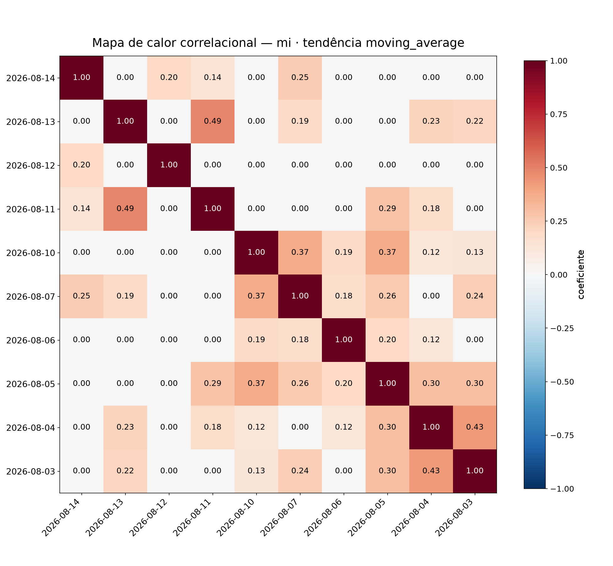
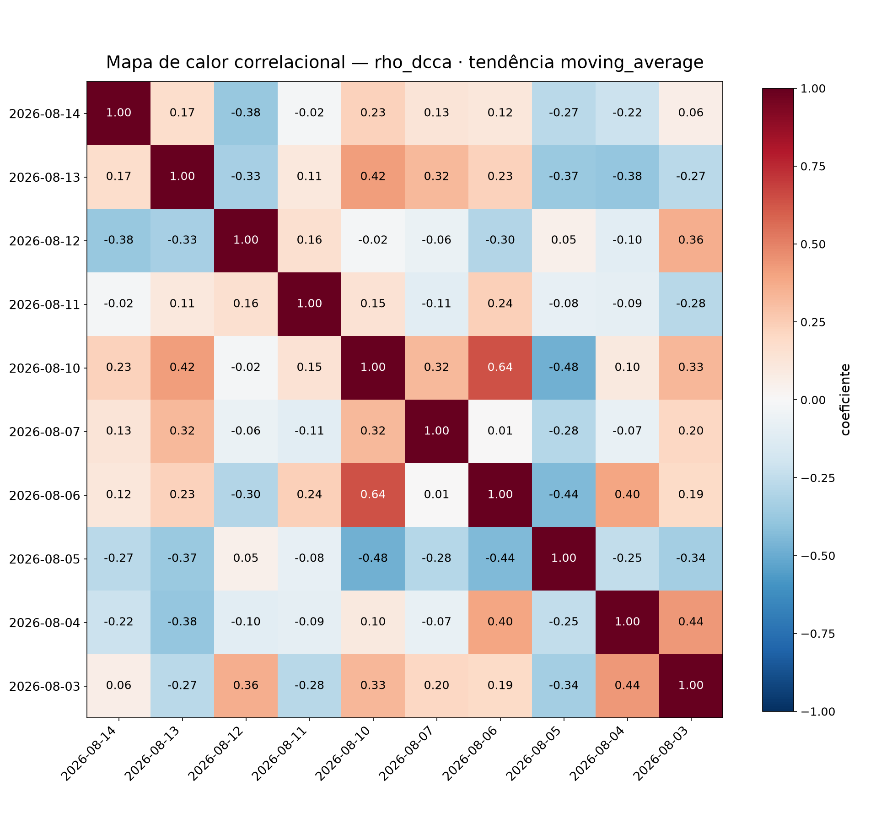
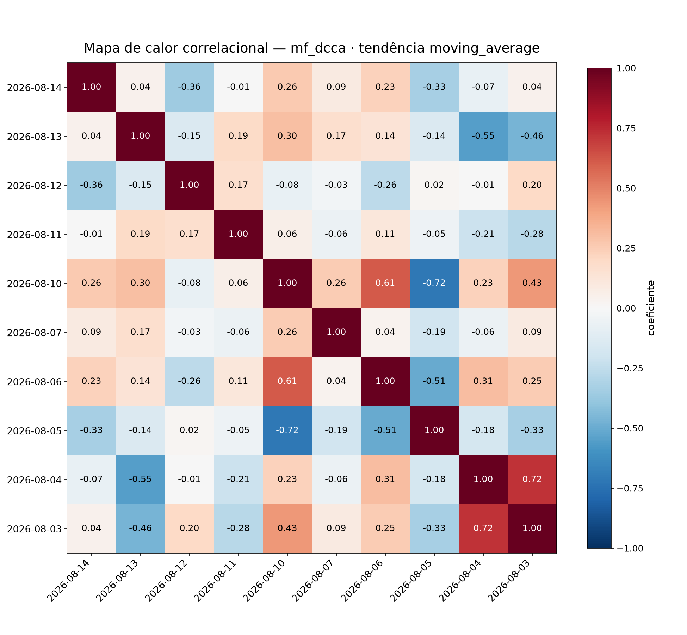
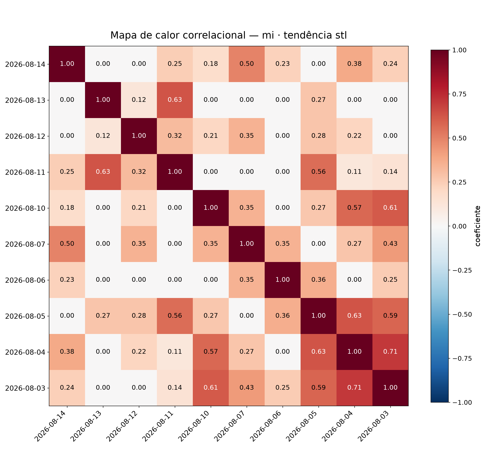
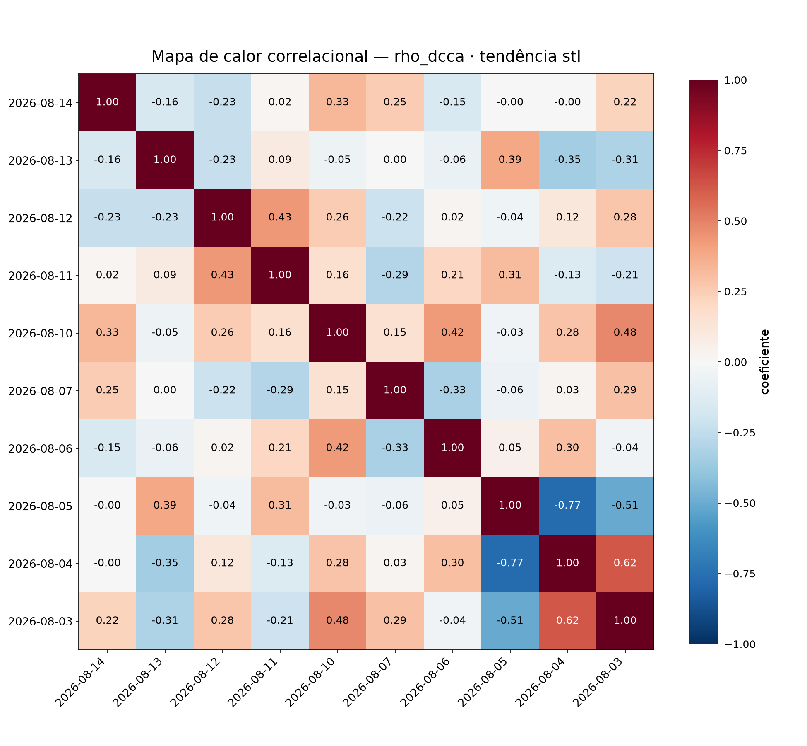
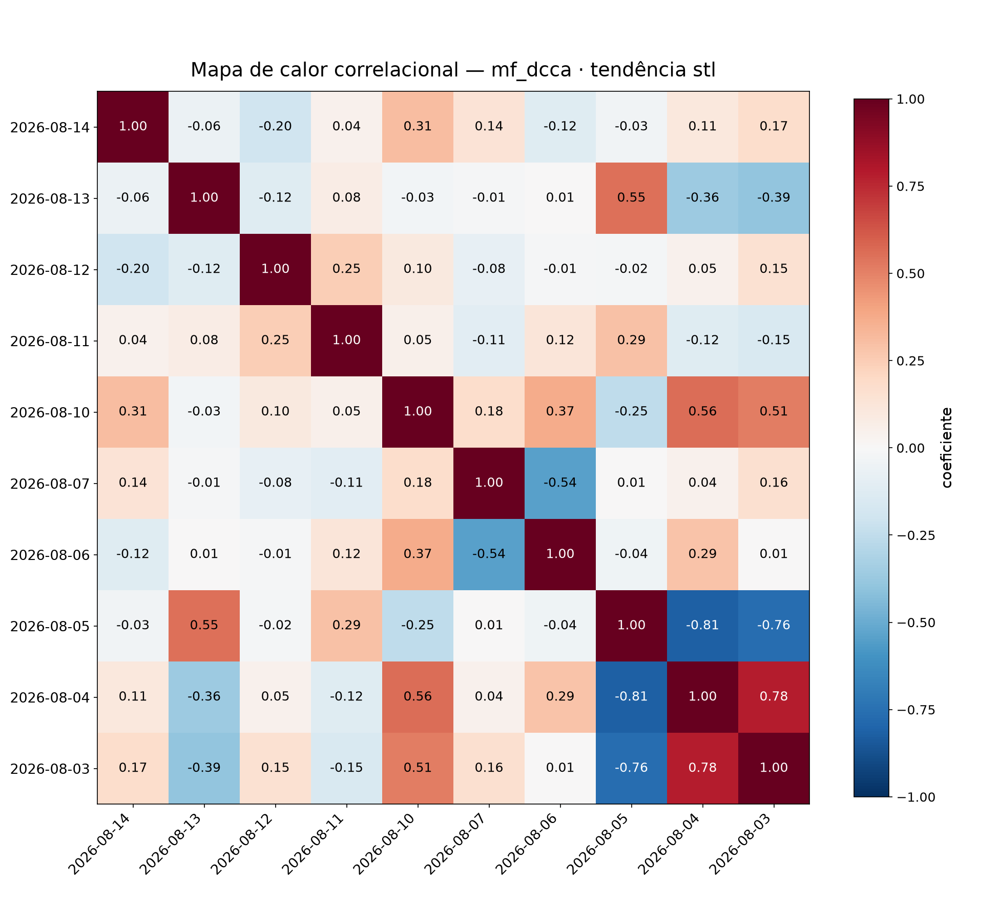

# Amostragem — correlação cruzada (WINQ26, 10 dias)

## Parâmetros

- valor da série: `log_return`
- métodos: mi, rho_dcca, mf_dcca
- janela: 10:00–17:00 (America/Sao_Paulo)
- cobertura mínima: 90%
- sub-janelas de estabilidade: 3
- informação mútua: 8 bins por quantis
- escala DCCA: 60 min
- ordem q do MF-DCCA (ρ_q): 4
- surrogates (deslocamento circular): 199 · semente 0
- tendências: moving_average, stl (série = `log_return` da tendência)
- média móvel centrada: 30 min · STL: período 30 min (robusto)

## Cobertura por dia

| dia | cobertura | |
|---|---|---|
| 2026-08-03 | 100.0% |  |
| 2026-08-04 | 100.0% |  |
| 2026-08-05 | 100.0% |  |
| 2026-08-06 | 100.0% |  |
| 2026-08-07 | 100.0% |  |
| 2026-08-10 | 100.0% |  |
| 2026-08-11 | 100.0% |  |
| 2026-08-12 | 100.0% |  |
| 2026-08-13 | 100.0% |  |
| 2026-08-14 | 100.0% |  |

## Resultados

### Tendência · moving_average

#### mi

Pares: 45 · significativos (p < 0.05): 4

| d_i | d_j | lag (dias) | coef. | p-valor | lag (min) | estab. (σ) |
|---|---|---|---|---|---|---|
| 2026-08-13 | 2026-08-11 | 2 | 0.489 | 0.020 | 0 | 0.163 |
| 2026-08-04 | 2026-08-03 | 1 | 0.426 | 0.010 | 0 | 0.212 |
| 2026-08-10 | 2026-08-07 | 3 | 0.374 | 0.035 | 0 | 0.209 |
| 2026-08-10 | 2026-08-05 | 5 | 0.373 | 0.010 | 0 | 0.155 |
| 2026-08-05 | 2026-08-03 | 2 | 0.302 | 0.150 | 0 | 0.205 |
| 2026-08-05 | 2026-08-04 | 1 | 0.298 | 0.100 | 0 | 0.239 |
| 2026-08-11 | 2026-08-05 | 6 | 0.285 | 0.185 | 0 | 0.231 |
| 2026-08-07 | 2026-08-05 | 2 | 0.263 | 0.155 | 0 | 0.063 |
| 2026-08-14 | 2026-08-07 | 7 | 0.252 | 0.235 | 0 | 0.256 |
| 2026-08-07 | 2026-08-03 | 4 | 0.243 | 0.250 | 0 | 0.176 |

#### rho_dcca

Pares: 45 · significativos (p < 0.05): 7

| d_i | d_j | lag (dias) | coef. | p-valor | lag (min) | estab. (σ) |
|---|---|---|---|---|---|---|
| 2026-08-10 | 2026-08-06 | 4 | 0.636 | 0.005 | 0 | 0.604 |
| 2026-08-10 | 2026-08-05 | 5 | -0.482 | 0.020 | 0 | 0.595 |
| 2026-08-06 | 2026-08-05 | 1 | -0.442 | 0.020 | 0 | 0.341 |
| 2026-08-04 | 2026-08-03 | 1 | 0.437 | 0.135 | 0 | 0.576 |
| 2026-08-13 | 2026-08-10 | 3 | 0.418 | 0.010 | 0 | 0.047 |
| 2026-08-06 | 2026-08-04 | 2 | 0.397 | 0.105 | 0 | 0.379 |
| 2026-08-13 | 2026-08-04 | 9 | -0.383 | 0.020 | 0 | 0.174 |
| 2026-08-14 | 2026-08-12 | 2 | -0.381 | 0.060 | 0 | 0.223 |
| 2026-08-13 | 2026-08-05 | 8 | -0.370 | 0.025 | 0 | 0.467 |
| 2026-08-12 | 2026-08-03 | 9 | 0.362 | 0.075 | 0 | 0.076 |

#### mf_dcca

Pares: 45 · significativos (p < 0.05): 7

| d_i | d_j | lag (dias) | coef. | p-valor | lag (min) | estab. (σ) |
|---|---|---|---|---|---|---|
| 2026-08-04 | 2026-08-03 | 1 | 0.721 | 0.005 | 0 | 0.482 |
| 2026-08-10 | 2026-08-05 | 5 | -0.718 | 0.005 | 0 | 0.544 |
| 2026-08-10 | 2026-08-06 | 4 | 0.611 | 0.050 | 0 | 0.457 |
| 2026-08-13 | 2026-08-04 | 9 | -0.548 | 0.005 | 0 | 0.186 |
| 2026-08-06 | 2026-08-05 | 1 | -0.507 | 0.010 | 0 | 0.298 |
| 2026-08-13 | 2026-08-03 | 10 | -0.463 | 0.035 | 0 | 0.329 |
| 2026-08-10 | 2026-08-03 | 7 | 0.434 | 0.055 | 0 | 0.585 |
| 2026-08-14 | 2026-08-12 | 2 | -0.357 | 0.020 | 0 | 0.220 |
| 2026-08-14 | 2026-08-05 | 9 | -0.334 | 0.060 | 0 | 0.295 |
| 2026-08-05 | 2026-08-03 | 2 | -0.329 | 0.050 | 0 | 0.243 |

### Tendência · stl

#### mi

Pares: 45 · significativos (p < 0.05): 9

| d_i | d_j | lag (dias) | coef. | p-valor | lag (min) | estab. (σ) |
|---|---|---|---|---|---|---|
| 2026-08-04 | 2026-08-03 | 1 | 0.706 | 0.005 | 0 | 0.143 |
| 2026-08-05 | 2026-08-04 | 1 | 0.628 | 0.005 | 0 | 0.184 |
| 2026-08-13 | 2026-08-11 | 2 | 0.626 | 0.005 | 0 | 0.237 |
| 2026-08-10 | 2026-08-03 | 7 | 0.611 | 0.005 | 0 | 0.189 |
| 2026-08-05 | 2026-08-03 | 2 | 0.586 | 0.020 | 0 | 0.259 |
| 2026-08-10 | 2026-08-04 | 6 | 0.574 | 0.005 | 0 | 0.010 |
| 2026-08-11 | 2026-08-05 | 6 | 0.557 | 0.005 | 0 | 0.202 |
| 2026-08-14 | 2026-08-07 | 7 | 0.495 | 0.025 | 0 | 0.193 |
| 2026-08-07 | 2026-08-03 | 4 | 0.426 | 0.045 | 0 | 0.157 |
| 2026-08-14 | 2026-08-04 | 10 | 0.376 | 0.075 | 0 | 0.197 |

#### rho_dcca

Pares: 45 · significativos (p < 0.05): 3

| d_i | d_j | lag (dias) | coef. | p-valor | lag (min) | estab. (σ) |
|---|---|---|---|---|---|---|
| 2026-08-05 | 2026-08-04 | 1 | -0.770 | 0.005 | 0 | 0.112 |
| 2026-08-04 | 2026-08-03 | 1 | 0.622 | 0.060 | 0 | 0.480 |
| 2026-08-05 | 2026-08-03 | 2 | -0.506 | 0.045 | 0 | 0.463 |
| 2026-08-10 | 2026-08-03 | 7 | 0.478 | 0.065 | 0 | 0.719 |
| 2026-08-12 | 2026-08-11 | 1 | 0.431 | 0.070 | 0 | 0.391 |
| 2026-08-10 | 2026-08-06 | 4 | 0.425 | 0.115 | 0 | 0.531 |
| 2026-08-13 | 2026-08-05 | 8 | 0.389 | 0.070 | 0 | 0.153 |
| 2026-08-13 | 2026-08-04 | 9 | -0.349 | 0.100 | 0 | 0.421 |
| 2026-08-14 | 2026-08-10 | 4 | 0.332 | 0.160 | 0 | 0.291 |
| 2026-08-07 | 2026-08-06 | 1 | -0.328 | 0.005 | 0 | 0.409 |

#### mf_dcca

Pares: 45 · significativos (p < 0.05): 5

| d_i | d_j | lag (dias) | coef. | p-valor | lag (min) | estab. (σ) |
|---|---|---|---|---|---|---|
| 2026-08-05 | 2026-08-04 | 1 | -0.813 | 0.005 | 0 | 0.201 |
| 2026-08-04 | 2026-08-03 | 1 | 0.783 | 0.035 | 0 | 0.417 |
| 2026-08-05 | 2026-08-03 | 2 | -0.761 | 0.030 | 0 | 0.441 |
| 2026-08-10 | 2026-08-04 | 6 | 0.557 | 0.050 | 0 | 0.491 |
| 2026-08-13 | 2026-08-05 | 8 | 0.547 | 0.005 | 0 | 0.106 |
| 2026-08-07 | 2026-08-06 | 1 | -0.543 | 0.005 | 0 | 0.323 |
| 2026-08-10 | 2026-08-03 | 7 | 0.512 | 0.060 | 0 | 0.676 |
| 2026-08-13 | 2026-08-03 | 10 | -0.395 | 0.060 | 0 | 0.347 |
| 2026-08-10 | 2026-08-06 | 4 | 0.371 | 0.120 | 0 | 0.415 |
| 2026-08-13 | 2026-08-04 | 9 | -0.362 | 0.060 | 0 | 0.323 |

